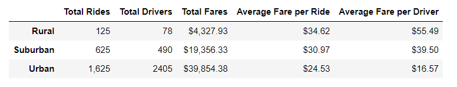
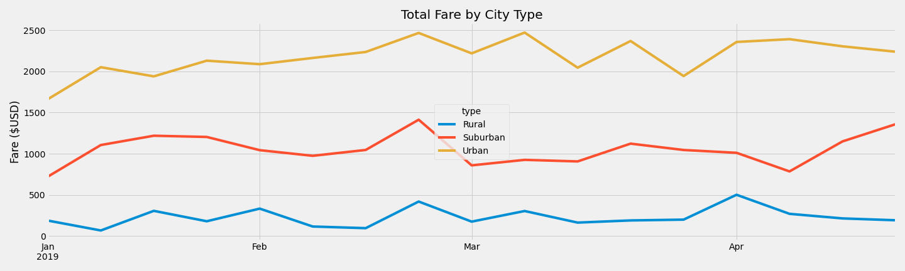

# PyBer_Analysis

## Overview
The purpose of this analysis is to review total rides, driver count, and total fares for a ride share service across urban, suburban, and rural communities and to provide recommendations.  After reviewing this data, recommmendations will be provided for expanding the ride share business model.

## Results

Rural communities pull in the lowest overall fares  but generate the highest fare cost per ride on average.  This is likely due to less concentrated city centers in rural areas and the need for traveling farther distances.  Suburban areas generate significantly more revenue from fares than rural areas and at a lower per-ride cost to the user, likely due to higher population density.  Urban areas, however, generate the most revenue from fares at nearly twice the rate of suburban rides and five times as much as rural rides.  The cost per user is also the most affordable, suggesting the the revenue is coming from the volume of rides rather than longer, more expensive rides.  

## Summary
### Recommendations
1. Build more ubiquity in  suburban areas, there are nearly three times as many drivers in urban areas.  It will be more difficult to grow in sparsely populated rural areas but suburban areas could represent areas of growth with sufficient scaffolding.
2. Consider raising fares in urban areas.  These areas count for the highest number of rides overall and the lowest fare price.
3. Consider lowering the fares in rural areas to generate more buy in.  This will be the most challenging area to grow in due to the lack of population density, so building a customer base may require the most investment.